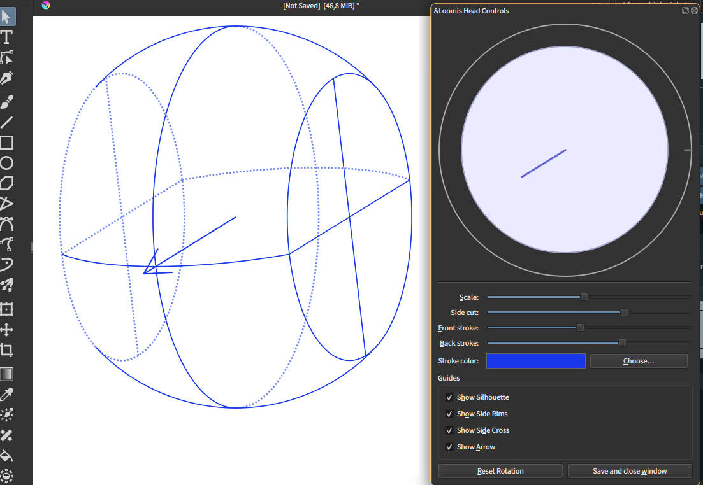

# Loomis Head for Krita

A small Krita plugin that renders an adjustable Loomis head as clean SVG vectors. It lets you rotate the head, toggle construction guides, and set stroke appearance.

## Features

- Generates Loomis head guides as SVG paths in the current document.
- Interactive rotation via a trackball.
- Optional guides: silhouette, side flats (rims), and cross lines.
- Separate front/back stroke widths; back lines are dashed with lower opacity.
- Stroke color picker with live preview.

## Requirements

- Krita with Python support
- Python ≥ 3.7

## Installation

- Download the newest loomis_head-...zip) [here](https://github.com/lm0ss/loomis-head-krita/releases) 
- In Krita: Tools → Scripts → Import Plugin From File.
- Enable the plugin, restart Krita.

## Usage

Hopefully the usage is self explanatory, two remarks though:

To improve the performance of the head rotation, it gets rendered in lower resolution.
This causes a few clipping issues and maybe a few lines cut short a little.

Make sure to click "Save" once you are done with the settings. The head will be rerendered in a higher resolution. 

Due to technical limitations, you should not move the head while the settings window is open. If you do that, changing the settings will render the head in the center position again. 

## Controls

- Scale: Overall head size.
- Side cut: Depth/position of the side flats (lower = deeper cut, higher = shallower).
- Front stroke: Stroke width for visible (front) lines.
- Back stroke: Stroke width for hidden (back) lines (dashed).
- Stroke color
- Guides:
  - Show Silhouette: Outer great circle.
  - Show Side Rims: Ellipses of the left/right flats.
  - Show Side Cross: Vertical and depth cross on each flat.
  - Show Arrow: Forward direction indicator.
- Actions:
  - Reset Rotation
  - Save and close window

# Preview

(Click for a video)
